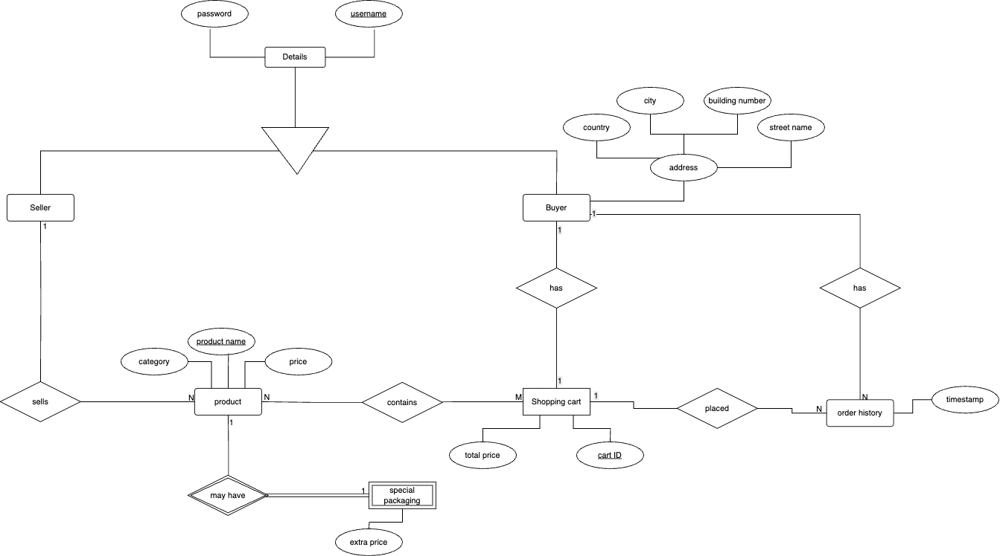

# 🛒 Food Store Management System

A Java project integrated with **PostgreSQL 17** for managing buyers, sellers, products, shopping carts, and order history.

---

## 📚 Project Overview

This system allows users to manage a food store with the following functionalities:

- Add and manage **Sellers** and **Buyers**.
- Sellers can add **Products** to the store.
- Buyers can add products to **Shopping Cart** and make **Payments**.
- Buyers' **Order History** is stored and can be restored.
- Products can have **special packaging** with extra costs.
- Display products by **category**.

---

## 👤 Users

- **Buyer**: Can purchase products, view shopping cart, pay, and see order history.
- **Seller**: Can add products, manage items, and see their products.

---

## 🏷️ Database Entities

The database includes **8 tables**:

1. **details** – Stores all users' credentials.
2. **buyerTable** – Buyer details (address, username).
3. **sellerTable** – Seller details.
4. **productTable** – Products listed by sellers.
5. **specialPackaging** – Extra price for special packaging.
6. **shoppingCartTable** – Buyers' current shopping carts.
7. **cartProductTable** – Products added to a specific cart.
8. **orderHistoryTable** – Stores completed orders with timestamps.

---

## 🗂️ ERD



---

## 💾 SQL Scripts Overview

The project includes SQL scripts for setting up and populating the PostgreSQL database. They are divided into three main parts:

1. **Creating Tables** 🏗️ – Defines the structure of all database tables including users, products, carts, and order history.  
2. **Inserting Data** ➕ – Populates the tables with sample buyers, sellers, products, and shopping carts for testing.  
3. **Triggers & Constraints** ⚡ – Ensures data integrity, e.g., prevents a user from being both a buyer and a seller.

---

## 🛠️ Prerequisites
- ☕ **Java 17** – Core program logic  
- 🐘 **PostgreSQL 17** – Database engine  
- 📦 **JDBC (JAR connector)** – For database connection  
- 🖥️ **pgAdmin** – For database management  

---

## ⚙️ How to Run

## 🛠️ Step 1: Prepare the Database

Open **pgAdmin** or PostgreSQL console.  
Create a new database (replace `<username>` with your PostgreSQL username):

```sql
CREATE DATABASE Ecommerce

###Run the SQL files in order:

1) psql -U <username> -d Ecommerce -f pgAdmin/create_tables.sql
2) psql -U <username> -d Ecommerce -f pgAdmin/insert_data.sql
3) psql -U <username> -d Ecommerce -f pgAdmin/triggers.sql
```

## 🛠️ Step 2: Update Database Connection

```java
String dbURL = "jdbc:postgresql://localhost:5432/superstore";
String username = "<your_username>";
String pwd = "<your_password>";
```

## 🛠️ Step 3: Compile Java Files with JDBC JAR

1) Download the PostgreSQL JDBC JAR (e.g., postgresql-42.6.0.jar).
2) From the project root folder, run:
```bash
javac -cp ".:postgresql-42.6.0.jar" -d bin src/main/java/org/example/*.java
```
## 🖥️ Step 4: Run the Program

```bash
java -cp ".:bin:postgresql-42.6.0.jar" org.example.Main
```


